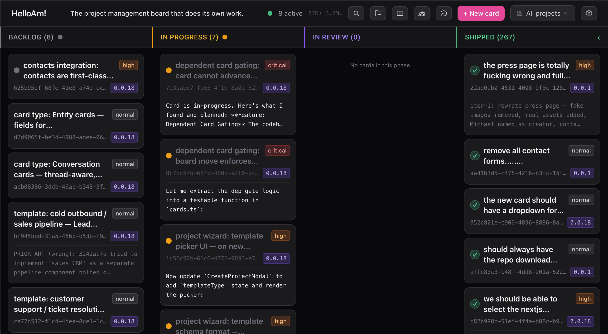

---

I'm **Mike** — software architect, cognitive systems builder, Gen X. Been coding since 13.

I build infrastructure for human-AI collaboration. Not wrappers. Not demos. Systems that own outcomes, remember context, and ship work autonomously — with every action as an auditable git commit.

## What I'm building

**[am-agi](https://github.com/augmentedmike/am-agi)** — A production AI worker, built in public. Persistent memory, kanban state machine, git-driven execution loop. Manages real work: software, content, logistics, research. The agent that doesn't forget you exist between sessions.

> Short-term context + long-term embeddings. Every state change is a commit. You can read all of it in an afternoon.

## Stack

## Activity

<picture>
  <source media="(prefers-color-scheme: dark)" srcset="https://raw.githubusercontent.com/augmentedmike/augmentedmike/output/github-snake-dark.svg" />
  <source media="(prefers-color-scheme: light)" srcset="https://raw.githubusercontent.com/augmentedmike/augmentedmike/output/github-snake.svg" />
  
</picture>

---

## Philosophy

**Competence is care.** The agent that doesn't ship is just a chatbot. Memory lives on your machine. Execution is traceable. No black boxes.

> The boulder never stops.

---

[helloam.bot](https://helloam.bot) · augmentedmike@gmail.com
