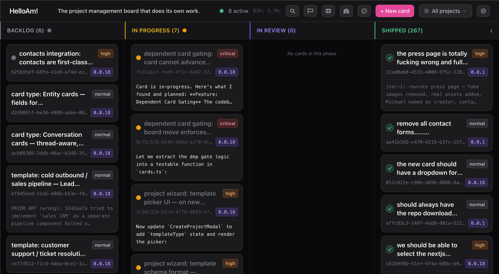

---

# Michael O'Neal

**Staff / Senior Systems & Fullstack Engineer**  
*20+ Years of Engineering · Distributed Systems · Cloud Infrastructure · AI-Native Tooling*

I am a pragmatic, production-focused systems builder with over two decades of experience delivering high-availability software. My career spans distributed backend systems, cloud-native infrastructure, automated developer tooling, and modern full-stack systems.

I specialize in **AI-native engineering**—designing and deploying deterministic, auditable, and observable LLM pipelines, robust agentic workflows, and high-performance ML orchestration layer tools. I focus on engineering rigor, operational maturity, and building systems that run predictably and reliably in enterprise production environments.

---

### ⚡ Professional Highlights

* **20+ Years of Hands-on Engineering:** Proven track record spanning startups to scale-ups, building resilient systems from monoliths to microservices.
* **Production & SRE Mindset:** Deep focus on operational reliability, high observability (metrics, tracing, logs), auto-scaling, and secure, auditable pipelines.
* **AI-Native Engineering Partner:** Specializing in deterministic, state-driven AI integration, agentic developer workflows, and scalable ML infra.
* **Low-Risk, Senior Contributor:** Calm, technical leader who prioritizes predictable shipping, clear system architecture, and robust automated test coverage.

---

### 💬 What Colleagues Say

<table>
  <tr>
    <td width="120" valign="top">
      
    </td>
    <td valign="top">
      

        <em>"I've worked with Mike for over five years across multiple projects. He's a highly qualified engineer, but what sets him apart is how quickly he learns and understands new domains."</em>
      

      

        <em>"As a product manager, when I bring him a feature or tool that needs to be built, the first thing he does is start asking the business questions alongside the engineering questions. That's rare — and it can't be quantified."</em>
      

      

        <em>"When you have an engineer who's solid on engineering principles, can build and ship deliverables quickly, and also understands the business context behind every ask, that's what makes someone a unicorn in this field."</em>
      

      

        <strong>— Ryan Bent</strong>, <em>Sr. Product Manager, Signet Corp.</em>
      

    </td>
  </tr>
</table>

---

### 🛠 Areas of Focus

* **Distributed Systems & Architecture:** Designing high-throughput, fault-tolerant backend architectures, resilient event-driven systems, and clean, scalable APIs.
* **AI & Agentic Infrastructure:** Developing reliable, state-machine-driven agent orchestration, production RAG pipelines, vector search optimization, and deterministic prompt/chain engineering.
* **Production Engineering & DevOps:** Infrastructure as Code (Terraform), container orchestration (Docker, Kubernetes), automated CI/CD release pipelines, and full-stack observability.
* **Developer Experience (DX) & Tooling:** Designing custom CLI utilities, automated build/test workflows, and git-integrated developer agents.

---

### 💻 Core Technologies

* **Languages:** TypeScript/JavaScript, Rust, Python, Go, SQL, Bash
* **Frameworks & Runtimes:** Node.js, Bun, Next.js, FastAPI, React
* **Data & Vector Stores:** PostgreSQL, SQLite, Redis, Pinecone, pgvector
* **Cloud & Infrastructure:** AWS, GCP, Docker, Kubernetes, Terraform, GitHub Actions
* **AI Orchestration:** Anthropic/OpenAI SDKs, LangChain, semantic routers, custom state-machine engines

---

### 🚀 Currently Building

**[am-agi](https://github.com/augmentedmike/am-agi)** — A production-ready AI task execution and software engineering framework.
* **Deterministic Execution:** Uses robust finite-state machines to manage and trace execution paths, avoiding unpredictable AI loops.
* **Git-Driven Auditability:** Every state change and task action generates an auditable, isolated git commit for total execution transparency.
* **Context Engine:** Integrates high-performance context retrieval and local relational storage for accurate long-running sessions.
* **Developer-Centric:** Fully controllable via CLI, designed to integrate seamlessly into existing terminal and CI/CD workflows.

*Visualizing execution states and task loops:*

---

### 📬 Connect & Collaborate

* **Portfolio & Blog:** [augmentedmike.com](https://augmentedmike.com)
* **Project Demo:** [helloam.bot](https://helloam.bot)
* **Email:** [augmentedmike@gmail.com](mailto:augmentedmike@gmail.com)
* **Social:** [X / Twitter](https://x.com/_augmentedmike) · [GitHub](https://github.com/augmentedmike)

---

<picture>
  <source media="(prefers-color-scheme: dark)" srcset="https://raw.githubusercontent.com/augmentedmike/augmentedmike/output/github-snake-dark.svg" />
  <source media="(prefers-color-scheme: light)" srcset="https://raw.githubusercontent.com/augmentedmike/augmentedmike/output/github-snake.svg" />
  
</picture>
